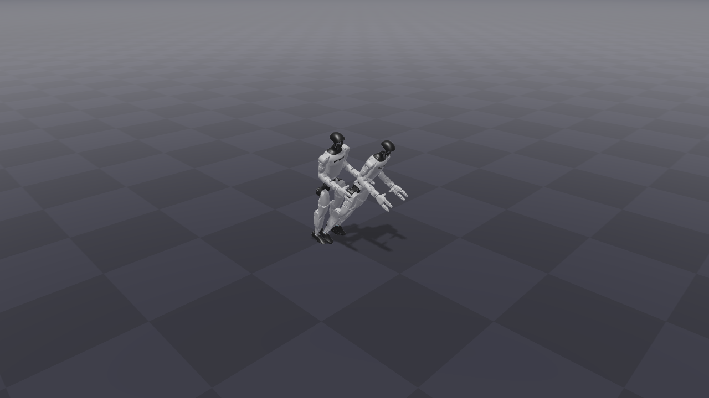
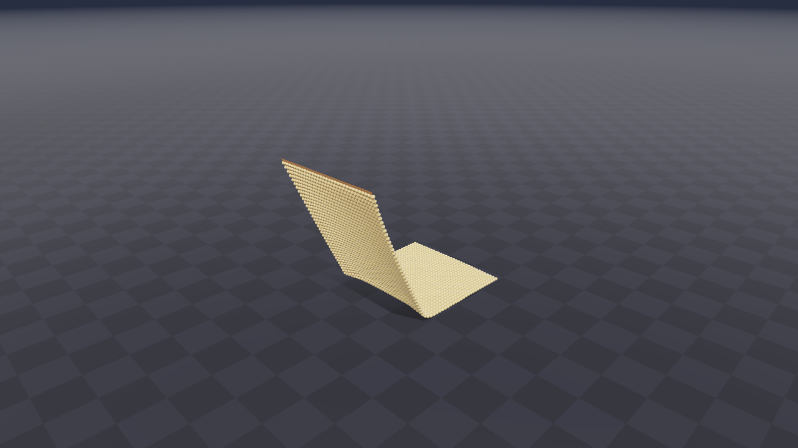
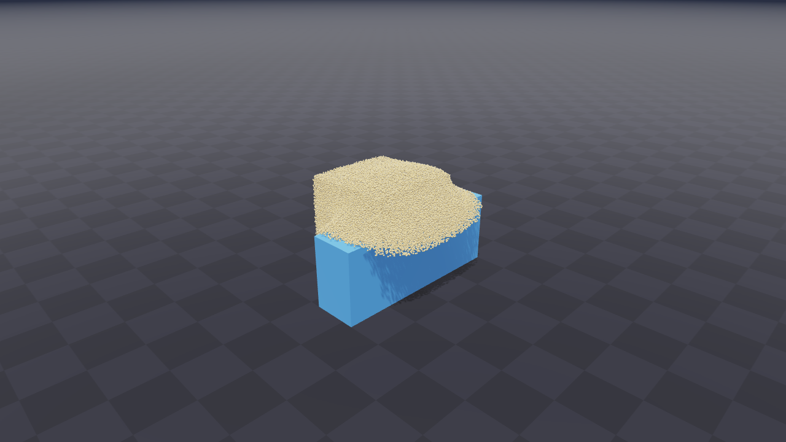
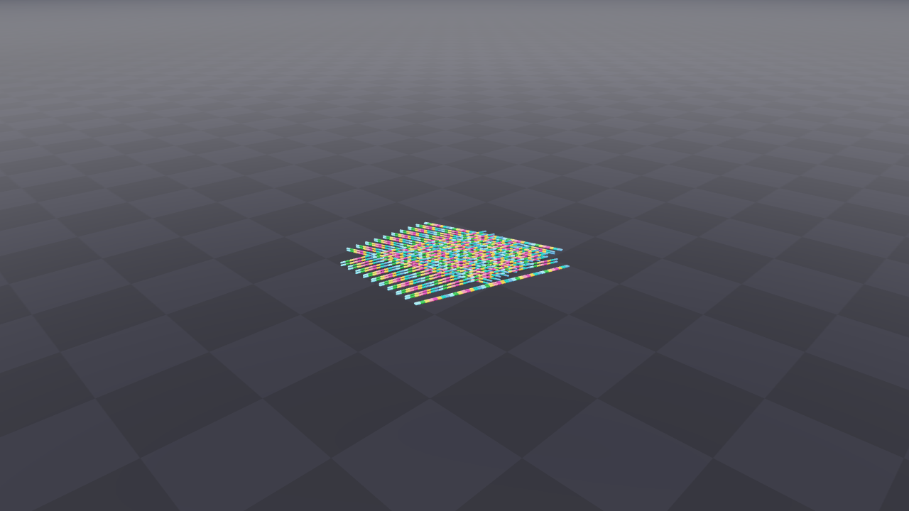
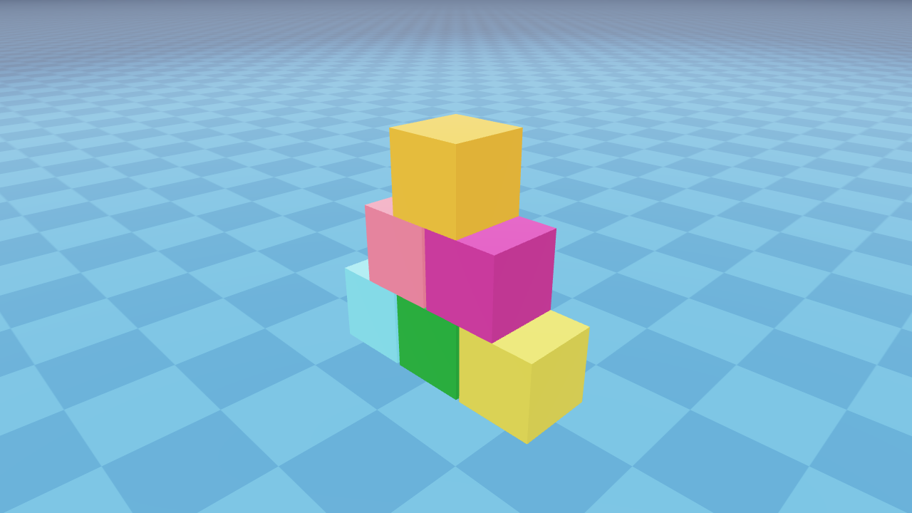
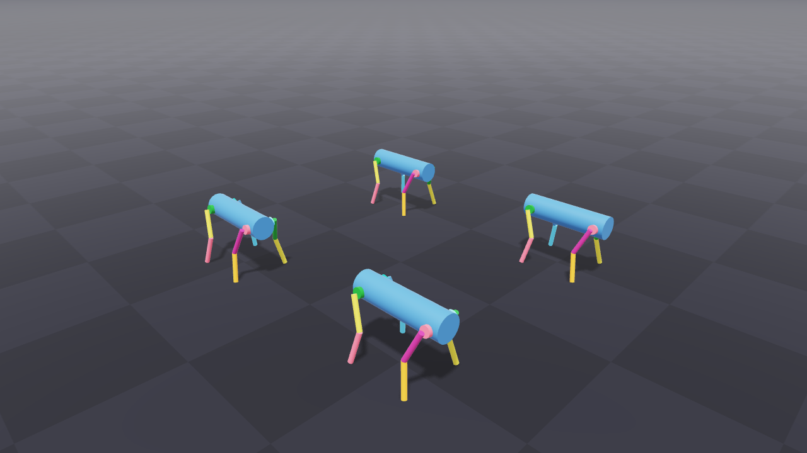
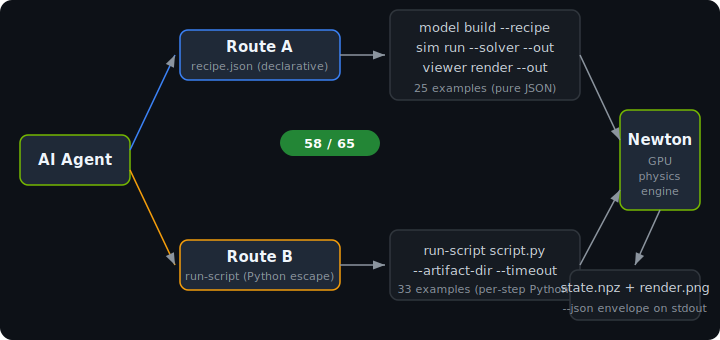

<div align="center">


<h1>newton-cli</h1>

**Let AI agents drive GPU physics simulations with JSON — no Python required.**<br>
**When Python is needed, `run-script` wraps it with structured output.**

<p>
  <a href="#-quick-start"></a>
  <a href="#-coverage"></a>
  <a href="#-supported-solvers"></a>
  
</p>

<p>
  
  
  
  
  
</p>

[Features](#-why-newton-cli) · [Quick Start](#-quick-start) · [Gallery](#-gallery) · [Commands](#-commands) · [Architecture](#-architecture)

**Language / 语言:**&ensp;English&ensp;|&ensp;[简体中文](README.zh-CN.md)&ensp;|&ensp;[日本語](README.ja.md)&ensp;|&ensp;[한국어](README.ko.md)

</div>

---

## Gallery

Every image below was rendered by `newton-cli viewer render` — the same headless OpenGL path Newton's own viewer uses.

<table>
<tr>
<td align="center"><br><sub>Unitree G1 humanoid (MJCF)</sub></td>
<td align="center"><br><sub>Cloth hanging (XPBD)</sub></td>
<td align="center"><br><sub>Granular material (MPM)</sub></td>
</tr>
<tr>
<td align="center"><br><sub>40 cables settling (VBD)</sub></td>
<td align="center"><br><sub>Pyramid stacking (contacts)</sub></td>
<td align="center"><br><sub>4 ANYmal quadrupeds (URDF)</sub></td>
</tr>
</table>

<sub>All renders produced by 3 CLI commands — see <a href="#route-a--declarative-recipe">Route A</a> below.</sub>

---

## Why newton-cli

- **AI agents fill JSON, not Python.** The declarative recipe format turns scene description into structured data — the thing LLMs are best at.
- **Structured errors, not stack traces.** Every command outputs `{"schema":"newton-cli/v1","data":...}` with `--json`. Exit codes are deterministic: 0 ok / 2 arg error / 3 runtime / 4 missing dep / 5 timeout.
- **Two routes, one CLI.** Route A (recipe) covers passive simulation. Route B (run-script) covers custom kernels, policies, autograd — no capability gap.
- **Recipe is the model.** No opaque binary save/load. The JSON file IS the model. Inspect it, diff it, version-control it.
- **58 / 65 Newton examples driven end-to-end.** Rigid bodies, joints, URDF/MJCF importers, cloth, softbody, MPM, cables, SDF mesh contacts, differentiable sim, IK, selection — all through `newton-cli`.

---

## Quick Start

```bash
# 1. Clone (Newton is vendored alongside newton-cli)
git clone https://github.com/Terry-cyx/newton-cli.git && cd newton-cli/newton_cli

# 2. Create venv + install
uv venv --python 3.12
uv pip install -e .
uv pip install -e ../newton[importers,sim]

# 3. Verify
newton-cli version --json
newton-cli devices list --json

# 4. Run the test suite (29 tests)
uv run python -m unittest discover tests
```

> **For Claude Code / AI agents:** add `newton-cli` to `PATH` or invoke via
> `python -m newton_cli <command> --json`. Every command accepts `--json` for
> machine-readable output. The [CLAUDE.md](CLAUDE.md) file documents the full
> agent integration contract.

---

## Architecture

<div align="center">

</div>

### Route A — declarative recipe

The agent emits a `recipe.json` describing `ModelBuilder` calls. The CLI re-executes it, runs the solver, dumps `final.npz` + `render.png`. **25 examples** use this route.

```bash
# Build scene from JSON recipe
newton-cli model build --recipe scene.json --out model.json --device cuda:0 --json

# Simulate 100 frames at 60 fps with MuJoCo solver
newton-cli sim run --model model.json --solver SolverMuJoCo \
    --num-frames 100 --fps 60 --substeps 10 \
    --out final.npz --device cuda:0 --json

# Render final state to PNG (headless OpenGL)
newton-cli viewer render --model model.json --state final.npz \
    --out render.png --width 1280 --height 720 --json
```

<details>
<summary>Example recipe.json (pendulum)</summary>

```json
{
  "schema": "newton-cli/recipe/v1",
  "ops": [
    {"op": "add_body", "args": {"xform": {"p": [0,0,2], "q": [0,0,0,1]}}},
    {"op": "add_shape_sphere", "args": {"body": 0, "radius": 0.1}},
    {"op": "add_joint_revolute", "args": {
      "parent": -1, "child": 0,
      "parent_xform": {"p": [0,0,2], "q": [0,0,0,1]},
      "child_xform": {"p": [0,0,0], "q": [0,0,0,1]},
      "axis": [1,0,0]
    }},
    {"op": "add_ground_plane", "args": {}}
  ]
}
```
</details>

### Route B — run-script escape hatch

For examples that need per-step Python (custom `@wp.kernel`, torch policy, autograd), the agent writes a script and the CLI runs it with structured output. **33 examples** use this route.

```bash
newton-cli run-script my_sim.py \
    --artifact-dir outputs/ \
    --timeout 300 --json
```

The script sees `NEWTON_CLI_ARTIFACT_DIR` in its environment and can dump `final.npz`, plots, etc. for the agent to read back.

---

## Commands

| Command | What it does |
|---|---|
| `newton-cli version` | Newton / Warp / Python / CLI versions |
| `newton-cli devices list` | Available compute devices (CPU + CUDA) |
| `newton-cli api list [--module M]` | Browse Newton's public API symbols |
| `newton-cli api describe <symbol>` | Docstring + signature for any public symbol |
| `newton-cli model build --recipe R --out O` | Validate + materialize a recipe JSON |
| `newton-cli sim run --model M --solver S --out O` | Standard step loop → final state `.npz` |
| `newton-cli viewer render --model M --state S --out O` | Headless OpenGL → PNG snapshot |
| `newton-cli run-script <path> [--timeout T]` | Execute a Python script with structured output |
| `newton-cli examples list` | List all 65 built-in Newton examples |
| `newton-cli examples run <name> [-- args]` | Run a built-in example (forwards to Newton) |

All commands accept `--json` for machine-readable `{"schema":"newton-cli/v1","data":...}` output.

---

## Supported Solvers

| Solver | Physics domain | Route A | Route B |
|---|---|---|---|
| `SolverXPBD` | Cloth, soft body, rigid contacts | yes | yes |
| `SolverVBD` | Cables, rigid + deformable contacts | yes | yes |
| `SolverMuJoCo` | Articulated robots (MuJoCo-native) | yes | yes |
| `SolverImplicitMPM` | Granular, viscous, snow, mud | yes | yes |
| `SolverStyle3D` | Garment simulation (Style3D cloth) | — | yes |
| `SolverSemiImplicit` | Differentiable sim (autograd) | — | yes |
| Custom `@wp.kernel` | Anything user-defined | — | yes |

---

## Coverage

**58 / 65 Newton examples pass end-to-end through `newton-cli`.**

| Category | Route A (recipe) | Route B (run-script) | Total |
|---|---|---|---|
| Basic (pendulum, shapes, joints, heightfield, URDF, plotting) | 6 | 2 | 8 |
| Robots (cartpole, anymal_d, g1, h1, ur10, allegro, panda) | 5 | 3 | 8 |
| Cloth (hanging, bending, poker_cards, style3d, franka, h1, rollers, twist) | 4 | 4 | 8 |
| Softbody (hanging, gift, dropping_to_cloth, franka) | 3 | 1 | 4 |
| MPM (granular, multi_material, viscous, grain_rendering, snow, beam, twoway) | 4 | 3 | 7 |
| Cables (y_junction, pile, twist, bundle_hysteresis) | 2 | 2 | 4 |
| Contacts (pyramid, nut_bolt_hydro, nut_bolt_sdf, brick_stacking) | 3 | 1 | 4 |
| Diffsim (ball, bear, cloth, drone, soft_body) | — | 5 | 5 |
| Selection (articulations, cartpole, materials, multiple) | — | 4 | 4 |
| IK (franka, h1, custom) | — | 3 | 3 |
| Sensors (contact, imu, tiled_camera) | — | 3 | 3 |
| **Total** | **25** | **33** | **58** |

<details>
<summary>7 examples that don't pass (none are CLI capability gaps)</summary>

| Example | Reason |
|---|---|
| `robot_policy`, `robot_anymal_c_walk`, `mpm_anymal` | Require CUDA torch wheels (unavailable for Py3.13/Win via uv). Would pass on Linux + Py3.12. |
| `contacts_rj45_plug`, `replay_viewer` | Require interactive GL viewer features (`viewer.picking`, `register_ui_callback`). Cannot run headlessly. |
| `ik_cube_stacking` | Example's `test_final` asserts >70% world success rate; converges to 0% with default args. Upstream config issue. |
| `diffsim_spring_cage` | Example's own `np.allclose(grad_numeric, grad_analytic, atol=0.2)` fails. Numerical tolerance on this hardware. |

</details>

---

## Project Structure

```
newton_cli/
├── pyproject.toml              # hatchling build, newton path dep
├── README.md                   # this file
├── CLAUDE.md                   # agent integration contract
├── assets/                     # SVG/PNG for README
├── src/newton_cli/
│   ├── cli.py                  # argparse dispatcher (10 subcommands)
│   ├── recipes.py              # JSON recipe → ModelBuilder interpreter
│   ├── sim.py                  # step loop (all 7 solver backends)
│   ├── render.py               # headless OpenGL → PNG
│   ├── state_io.py             # .npz round-trip for State arrays
│   ├── io.py                   # JSON envelope + exit codes
│   └── _introspect.py          # API browser (allow-list walker)
├── tests/
│   ├── test_phase0_introspection.py    # 14 unit tests
│   ├── test_run_script.py              # 6 run-script contract tests
│   └── test_examples/                  # 58 per-example folders
│       ├── _shared/                    # visualize.py + b_route_runner.py
│       ├── basic_pendulum/             # recipe.json + run.ps1 + outputs/
│       ├── robot_g1/                   # recipe.json + run.ps1 + outputs/
│       └── ...                         # (58 total)
└── logs/                       # round summaries
```

---

## Development

```bash
# Run full test suite (29 tests, ~2 min)
uv run python -m unittest discover tests

# Run one example end-to-end (Route A)
cd tests/test_examples/robot_g1
powershell -ExecutionPolicy Bypass -File ./run.ps1

# Run one example end-to-end (Route B)
cd tests/test_examples/cable_twist
powershell -ExecutionPolicy Bypass -File ./run.ps1
```

See [CLAUDE.md](CLAUDE.md) for the full development guide and agent integration contract.

---

## License

MIT. Newton itself is licensed separately — see `../newton/LICENSE`.
